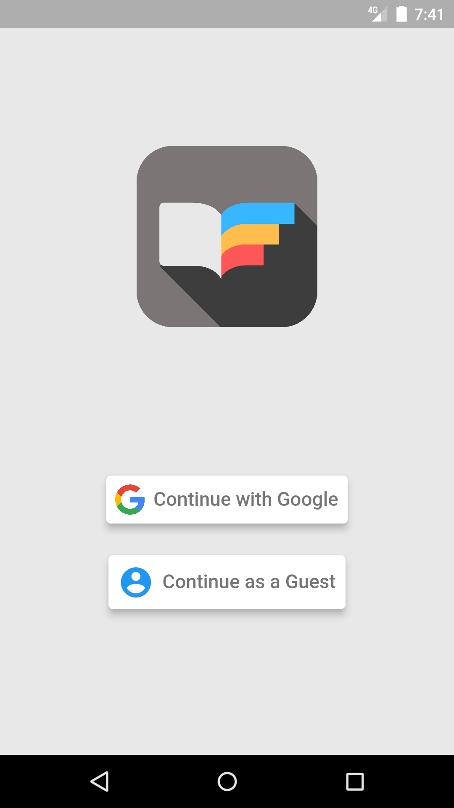

# Readmate Application

This is an ebook reading application. It presents the ebooks in the Gutenberg project to its users. Registered users can add e-books that in the app to their own bookshelves, so they don't have to remember anything about the last place they read.

There is a server in the backend and on this server the [Gutendex API](https://github.com/garethbjohnson/gutendex) is running. Apart from this, user information is kept in [Google Firebase](https://firebase.google.com/).

## Screenshots

Authentication View |  Home View for Registered User | Item Menu for Registered User
:-------------------------:|:-------------------------: | :-------------------------:
 |  | 

Bookshelf View for Registered User | Details View | Profile View for Registered User
:-------------------------:|:-------------------------: | :-------------------------:
  |  | 

Searching View | Reading View for Registered User | Home View for Guest User
:-------------------------:|:-------------------------: | :-------------------------:
  |  | 

Item Menu for Guest User | Profile View for Guest User | Reading View for Guest User
:-------------------------:|:-------------------------: | :-------------------------:
  |  | 

## Used Technologies

    - MVVM as architectural design
    - Provider as state management
    - Microsoft Azure for server
    - Google Firebase for database

## Contributors

    - Muhammed Serhat BOZKURT
    - Yunus Emre KARADAŞ
    - Burak Abdulbaki Ulu
    - Semih DÖNMEZ
